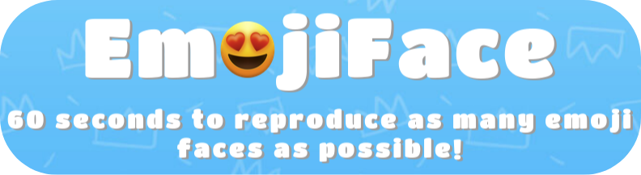
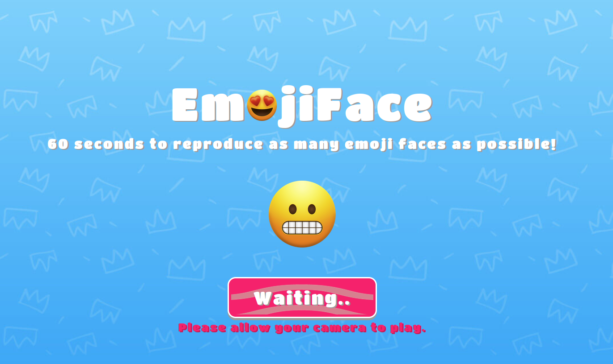

<h1 align="center">
   
  
   
EMOJIFACE 
</h1>
<h4 align="center">60 seconds to reproduce as many emoji faces as possible! Using your camera and IA face detection !</h4>
 

## WEB version 🌐

Le site est en live ici 👉 [EmojiFace](https://guillaume-rygn.github.io/EmojiFace/)

## Technologies utilisées ⚙️

Pour ce programme les technologies suivantes ont été utilisé :  

 
 
Le site est responsive. Bon jeu !

## Crédit 🔗
[Guillaume Reygner](https://github.com/guillaume-rygn)
